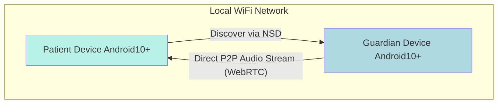

## Introduction

This document outlines the overall project architecture for Listen Care. Its primary goal is to serve as the guiding architectural blueprint for AI-driven development, ensuring consistency and adherence to chosen patterns and technologies.

### Starter Template or Existing Project

The PRD does not specify a pre-existing starter template. We will proceed by creating a standard Android Studio project configured for Kotlin, Jetpack Compose, and NDK support for C++ integration. This provides a clean, modern foundation.

## High Level Architecture

### Technical Summary

The architecture for Listen Care is a peer-to-peer (P2P) system designed for native Android devices, operating exclusively on a local WiFi network. It leverages WebRTC for direct, low-latency audio streaming, completely avoiding internet-based media servers. The core logic utilizes a combination of Kotlin/Jetpack Compose for the UI and high-performance C++ via the NDK for background processing, all within a single monorepo structure.

### High Level Project Diagram



### Architectural and Design Patterns

- **Peer-to-Peer (P2P) Architecture**: Utilizes WebRTC to enable direct communication between two Android devices on the same local network.
    - _Rationale_: This minimizes latency, removes the need for any server infrastructure, and enhances privacy by ensuring the media stream never leaves the local network.
- **Foreground Service**: The monitoring component on the 'Patient' device will run as a persistent Android Foreground Service.
    - _Rationale_: This is required by the Android OS to ensure the application can reliably access the microphone and network while in the background without being terminated.
- **Local Network Service Discovery**: The app will use Android's native Network Service Discovery (NSD) framework.
    - _Rationale_: This provides a robust, OS-supported method for discovering devices on the same WiFi network without requiring internet connectivity.

## Tech Stack

### Cloud Infrastructure

For the MVP, **Listen Care** is a purely peer-to-peer application and does not require any cloud infrastructure.

### Technology Stack Table

| Category           | Technology            | Version                                     | Purpose                                | Rationale                                                                                          |
| :----------------- | :-------------------- | :------------------------------------------ | :------------------------------------- | :------------------------------------------------------------------------------------------------- |
| **Language**       | Kotlin                | `Latest Stable`                             | Primary language for Android.          | Ensures use of the most current, stable language features.                                         |
| **User Interface** | Jetpack Compose BOM   | `Latest Stable`                             | Declarative UI toolkit for Android.    | Aligns with modern Android best practices; BOM manages library versions.                           |
| **Runtime**        | Android OS            | Min: API 29 (10) \<br\> Target: API 34 (14) | The operating system the app runs on.  | Minimum version targets older devices; targeting the latest ensures modern features are supported. |
| **P2P Comms**      | Google WebRTC Library | `Latest Stable`                             | Handles real-time audio streaming.     | The official library for implementing WebRTC on Android.                                           |
| **Native Dev**     | Android NDK           | `Latest Stable`                             | Enables C++ integration.               | Required for high-performance code; latest version ensures best tooling.                           |
| **Build System**   | Android Gradle Plugin | `Latest Stable`                             | Manages the application build process. | Ensures the most up-to-date and efficient build tooling is used.                                   |

## Data Models

The application's data models represent the in-memory state and locally saved settings, not a traditional database.

- **PeerDevice**: Represents a discovered device on the network, holding its name, ID, and network address for pairing.
- **MonitoringSession**: Holds the state of an active session (e.g., `ACTIVE`, `PAUSED`) and the roles of the local and remote devices.
- **AppSettings**: Persists user-configurable settings locally on the device.

## Database Schema

The application does not use a traditional database. The only persisted data is the `AppSettings`, stored locally using Android's Jetpack DataStore.

| Key                  | Data Type       | Description                                                                                               | Default Value        |
| :------------------- | :-------------- | :-------------------------------------------------------------------------------------------------------- | :------------------- |
| `deviceName`         | `String`        | The user-friendly name the device shows on the network.                                                   | "Listen Care Device" |
| `noiseSensitivity`   | `Enum (String)` | : The threshold for triggering a noise alert. Can be 'Quietest', 'Quiet', 'Normal', 'Loud', or 'Loudest'. | "Normal"             |
| `alertWithBeep`      | `Boolean`       | If true, the guardian device will play a sound on a noise alert.                                          | `true`               |
| `alertWithVibration` | `Boolean`       | If true, the guardian device will vibrate on a noise alert.                                               | `true`               |

## Source Tree

The project follows a modern, multi-module architecture to ensure separation of concerns and faster build times.

```plaintext
care-audio/
├── app/                  # Main application module (assembles all other modules)
│   └── src/main/java/com/careaudio/
├── core/
│   ├── audio/            # C++ AudioEngine source (NDK) and its Kotlin/JNI bridge
│   ├── data/             # SettingsRepository using Jetpack DataStore
│   ├── network/          # WebRTC, Discovery, and network models
│   └── ui/               # Shared Jetpack Compose components and the app theme
└── features/
    ├── monitoring/       # The main monitoring dashboard feature
    ├── pairing/          # The device discovery and pairing feature
    └── settings/         # The settings feature
```

## Infrastructure and Deployment

- **CI/CD Platform**: **GitHub Actions** will be used to automatically build and test the application on every push.
- **Error Reporting**: **Sentry** will be integrated to capture and report crashes and high-priority errors.
- **Environments**:
    - **Development**: Developer's local machine.
    - **Internal Testing**: Manual testing on two physical Android devices.
    - **Production**: The public listing on the Google Play Store.

## Error Handling Strategy

- **Error Propagation**: Functions that can fail will return Kotlin's built-in `Result` type, an approach similar to the `neverthrow` library, to ensure all errors are handled explicitly.
- **Logging**: **Timber** will be used for logging. Errors and warnings in the release build will be sent to **Sentry**.

## Coding Standards

- **Style & Linting**: We will use the official **Kotlin style guide**. **Detekt** will be used for static analysis, configured to encourage functional programming paradigms.
- **Immutability**: Prefer `val` over `var`. Functions must accept and return immutable collection types.
- **Composition Over Inheritance**: Favor composition. Classes will remain `final` by default.
- **Responsive Design**: For V1, the application will target portrait mode only. Full support for landscape and tablet layouts is a post-MVP enhancement.

## Test Strategy and Standards

- **Pyramid**: The strategy will focus on a strong base of **Unit Tests** (using JUnit5 and MockK) and a focused set of **Integration Tests**.
- **UI Testing**: UI-based integration tests of critical user flows will be written using the **Maestro** framework.

## Security

- **Data in Transit**: As per the PRD, the audio stream over local WiFi is **not encrypted** for the MVP.
- **Data at Rest**: Settings are stored in the app's private, sandboxed directory using Jetpack DataStore.
- **PII**: The application must not store any Personally Identifiable Information.
