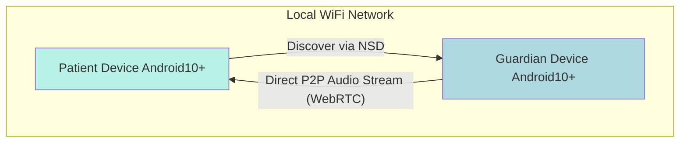

# High Level Architecture

## Technical Summary

The architecture for Listen Care is a peer-to-peer (P2P) system designed for native Android devices, operating exclusively on a local WiFi network. It leverages WebRTC for direct, low-latency audio streaming, completely avoiding internet-based media servers. The core logic utilizes a combination of Kotlin/Jetpack Compose for the UI and high-performance C++ via the NDK for background processing, all within a single monorepo structure.

## High Level Project Diagram

## Architectural and Design Patterns

- **Peer-to-Peer (P2P) Architecture**: Utilizes WebRTC to enable direct communication between two Android devices on the same local network.
    - _Rationale_: This minimizes latency, removes the need for any server infrastructure, and enhances privacy by ensuring the media stream never leaves the local network.
- **Foreground Service**: The monitoring component on the 'Patient' device will run as a persistent Android Foreground Service.
    - _Rationale_: This is required by the Android OS to ensure the application can reliably access the microphone and network while in the background without being terminated.
- **Local Network Service Discovery**: The app will use Android's native Network Service Discovery (NSD) framework.
    - _Rationale_: This provides a robust, OS-supported method for discovering devices on the same WiFi network without requiring internet connectivity.
